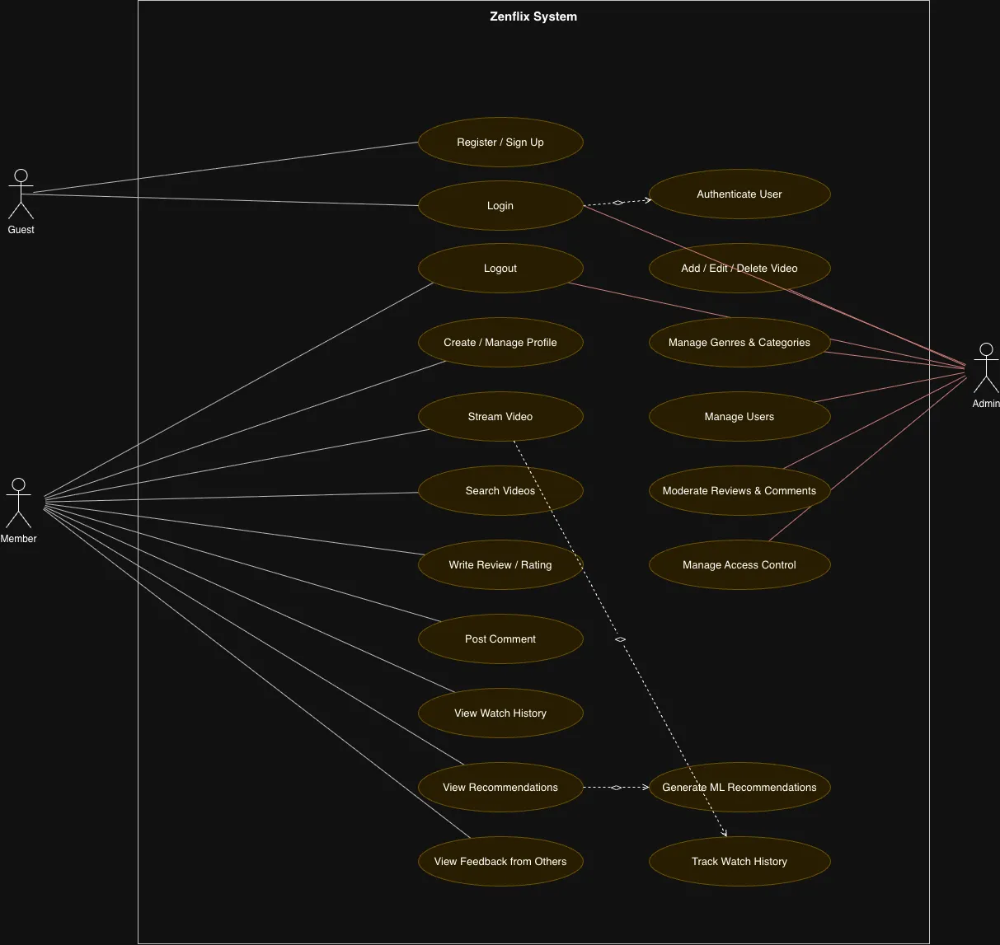
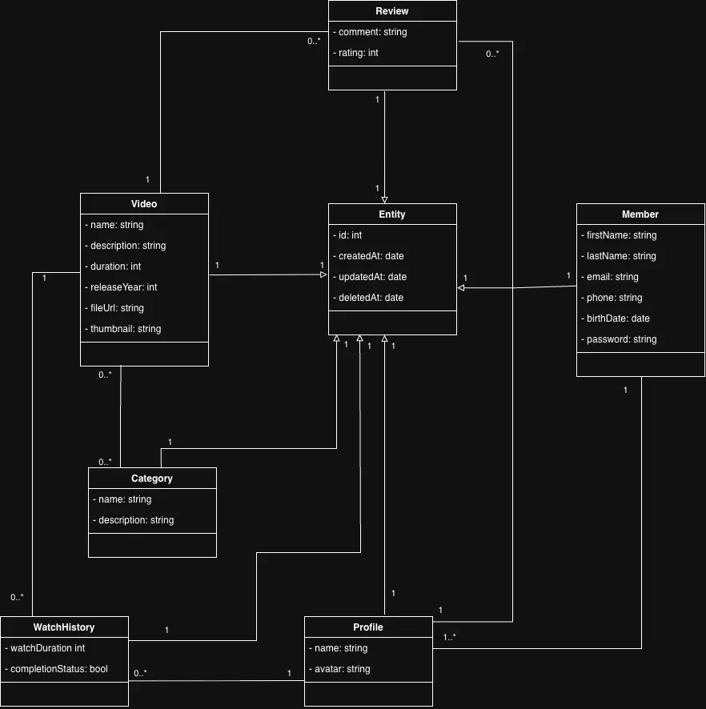
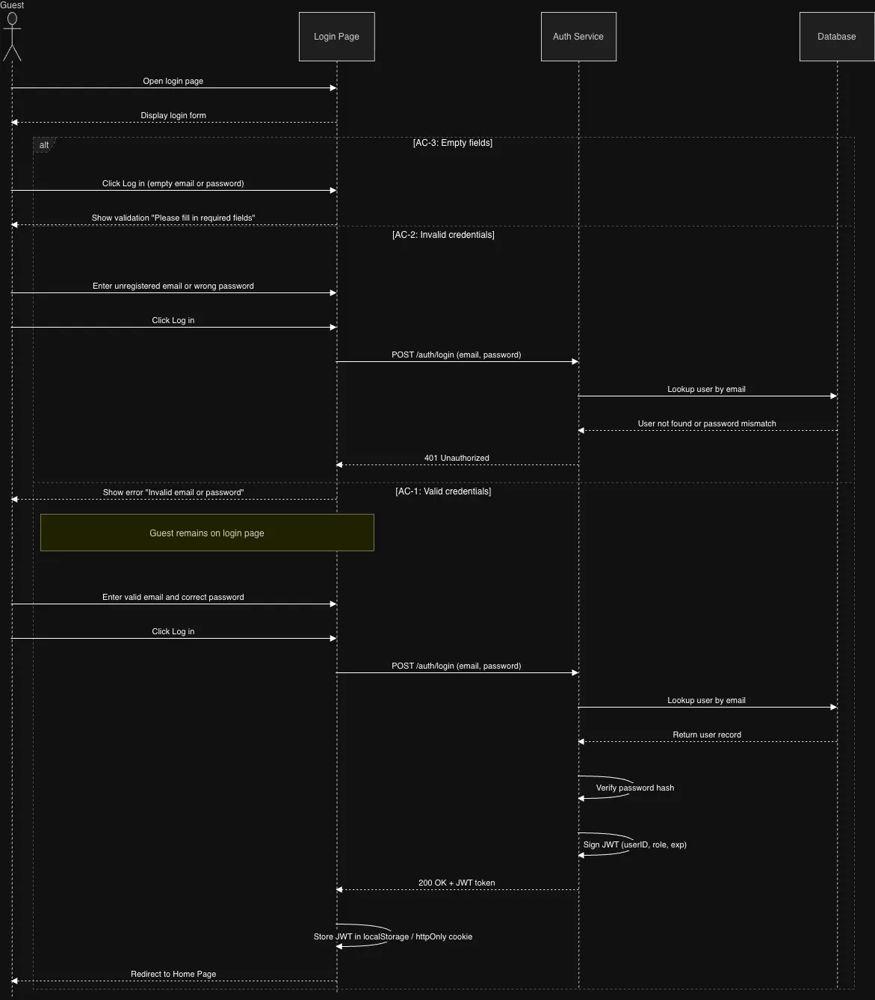
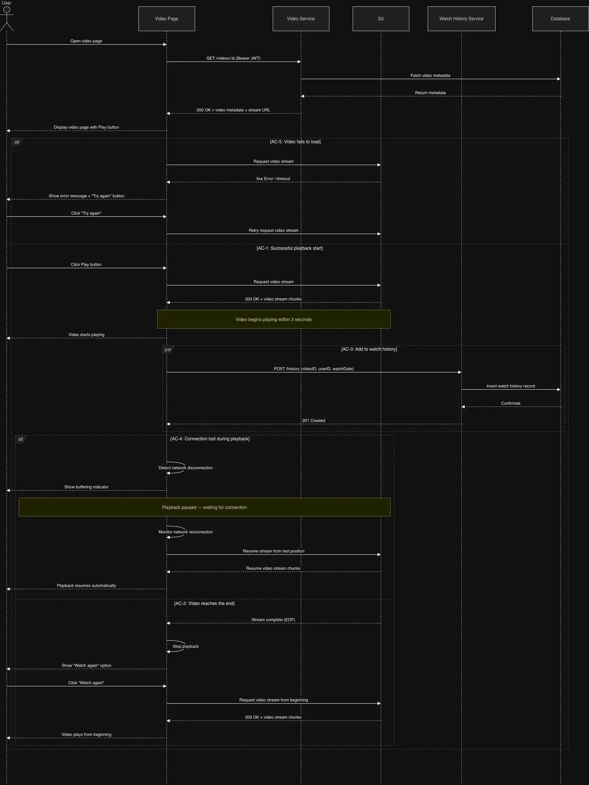

# Zenflix

An online video streaming platform with personalized recommendations, multi-profile support, and admin content management.

## Features

- **User** — Register, login, manage profiles, stream videos, search, review, comment, view watch history
- **Recommendations** — ML-powered suggestions based on watch history, ratings, and comments
- **Admin** — Full control over videos, genres, categories, users, and access

## Tech Stack

- Frontend: Responsive UI (web & mobile)
- Backend: REST API with authentication & access control
- ML: Recommendation engine
- Database: User data, watch history, reviews

## Getting Started

```bash
git clone https://github.com/zenflix-movie/app.git 
cd app
npm install
npm start
```

## Requirements

- Node.js 
- ReactJS
- Postgres
- Python 3.10+ (ML service)

## Use case


## Domain model


## Sequence diagram



## License

MIT
